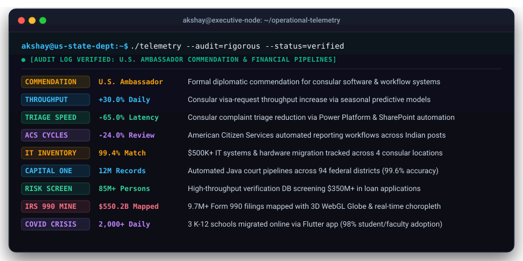

<h1>Akshay Kumar</h1>

<h3>Analytics Engineer &amp; STEM MBA Candidate · 7+ Years Enterprise DataOps</h3>

  <strong>Washington, DC</strong> · <a href="mailto:ak8335a@american.edu">ak8335a@american.edu</a> · <a href="tel:2024154366">(202) 415-4366</a>

  

 

<!-- Perfectly Balanced 2x2 Hero Badge Matrix (Zero Wrapping / Zero Orphaned Badges) -->
<table align="center" border="0" cellpadding="0" cellspacing="4">
  <tr align="center">
    <td>
      
    </td>
    <td>
      
    </td>
  </tr>
  <tr align="center">
    <td>
      
    </td>
    <td>
      
    </td>
  </tr>
</table>

 

 

---

  <h2>🏛️ Executive Background &amp; Strategic Track Record</h2>

<blockquote>
  <strong>STEM MBA Candidate</strong> at <strong>American University's Kogod School of Business</strong> (Washington, DC · Expected May 2027 · <strong>GPA 3.8/4.0</strong>) with <strong>7+ years of software engineering experience</strong> in data integration, forensic audits, and operational analytics. Built mission-critical decision-support systems for the <strong>U.S. Department of State / U.S. Embassy</strong> (formally commended by the <strong>U.S. Ambassador</strong>) and high-throughput financial data pipelines serving <strong>Capital One</strong>.
</blockquote>

 

<table width="100%">
  <tr>
    <td width="33%" valign="top">
      <h4>🏛️ U.S. Department of State</h4>
      
<strong>Business Analyst</strong> · <em>Nov 2022 – Sep 2025</em>

      <ul>
        <li>🎖️ <strong>Ambassador Commendation</strong> for consular software systems.</li>
        <li>⚡ <strong>+30% Visa Throughput</strong> via seasonal predictive models.</li>
        <li>⏱️ <strong>-65% Triage Time</strong> with Power Platform &amp; SharePoint automation.</li>
        <li>📉 <strong>-24% ACS Review Cycles</strong> via reporting pipelines.</li>
        <li>📦 <strong>99.4% Tracking Accuracy</strong> across $500K+ IT asset migration.</li>
      </ul>
    </td>
    <td width="33%" valign="top">
      <h4>💳 Capital One Delivery (AIS Info)</h4>
      
<strong>Software Engineer</strong> · <em>Nov 2021 – Nov 2022</em>

      <ul>
        <li>🛡️ <strong>12M Court Records</strong> across 94 federal districts (99.6% accuracy).</li>
        <li>🔍 <strong>85M+ Deceased Records</strong> screening $350M+ in loan applications.</li>
        <li>⚡ <strong>-40% Verification Latency</strong> via optimized RESTful endpoints.</li>
        <li>⏱️ <strong>30+ Hours Saved Weekly</strong> from manual audit elimination.</li>
      </ul>
    </td>
    <td width="33%" valign="top">
      <h4>💻 MS Star Computers</h4>
      
<strong>Software Developer</strong> · <em>Jul 2018 – Nov 2021</em>

      <ul>
        <li>🖥️ <strong>350+ Workstations</strong> maintained across 8 regional centers.</li>
        <li>⚡ <strong>99.8% System Uptime</strong> for mission-critical infrastructure.</li>
        <li>🏫 <strong>3 K-12 Schools Migrated</strong> online during COVID-19.</li>
        <li>📱 <strong>Flutter Educational Portal</strong>: 98% adoption, 2,000+ daily joins.</li>
        <li>⏱️ <strong>15+ Staff Hours Saved Weekly</strong> via Python/VBA automation.</li>
      </ul>
    </td>
  </tr>
</table>

 

---

  <h2>🖥️ Operational Telemetry &amp; Verified Audit Log</h2>
  
<em>Vector-rendered dark mode macOS terminal reflecting audited production metrics.</em>

   
  

 

---

  <h2>🚀 Flagship Deployments &amp; Live Interactive Systems</h2>
  
<em>High-Performance 2-Column Bento Grid · Click any button to launch the live WebGL/interactive application.</em>

<table width="100%">
  <!-- ROW 1 -->
  <tr>
    <td width="50%" valign="top">
      <h3>🌐 IRS 990 Philanthropic Spatial Miner</h3>
      

        
        
        
      

      

        Hardware-accelerated 3D WebGL spatial intelligence platform mapping <strong>$550.2B in charitable capital flow</strong>. Features interactive 3D Globe arcs, Plotly econometric log-log outlier detection matrices, and D3 TopoJSON US Choropleth with sub-millisecond tooltip tracking.
      

      

        <code>Python</code> · <code>Globe.gl (Three.js)</code> · <code>Plotly.js</code> · <code>D3.js</code> · <code>DuckDB</code>
      

      

        
        
      

    </td>
    <td width="50%" valign="top">
      <h3>⚡ AI Strategic Briefing Generator</h3>
      

        
        
        
      

      

        Autonomous 6-stage analytics pipeline with <strong>Three.js bioluminescent wave canvas</strong>: Raw CSV ingestion → schema inference → statistical profiling → Z-score &amp; CUSUM anomaly detection → Holt-Winters forecasting → Claude AI executive briefing synthesis.
      

      

        <code>Three.js</code> · <code>Python</code> · <code>Claude API</code> · <code>statsmodels</code> · <code>Chart.js</code>
      

      

        
        
      

    </td>
  </tr>

  <!-- ROW 2 -->
  <tr>
    <td width="50%" valign="top">
      <h3>📈 U.S. Retail Demand Forecast Engine</h3>
      

        
        
        
      

      

        18-month forward predictive demand model for U.S. Retail &amp; Food Services Sales using <strong>Holt-Winters triple exponential smoothing</strong> on 10+ years of Federal Reserve macroeconomic data. Includes Three.js constellation canvas and interactive Hyperparameter Tuning Studio.
      

      

        <code>Three.js</code> · <code>Python</code> · <code>statsmodels</code> · <code>Pandas</code> · <code>Chart.js</code>
      

      

        
        
      

    </td>
    <td width="50%" valign="top">
      <h3>🏛️ Diplomatic Resource &amp; Scheduling Optimizer</h3>
      

        
        
        
      

      

        Priority-aware greedy constraint-satisfaction scheduling engine built to resolve complex diplomatic constraints: <strong>180 high-priority meeting requests</strong> across 20 secure rooms and 150 cleared personnel with Three.js 3D kinetic lattice and live stress test simulation.
      

      

        <code>Three.js</code> · <code>JavaScript</code> · <code>Greedy CSP</code> · <code>Chart.js</code> · <code>HTML5</code>
      

      

        
        
      

    </td>
  </tr>

  <!-- ROW 3 -->
  <tr>
    <td width="50%" valign="top">
      <h3>📉 Economic Anomaly Detection Monitor</h3>
      

        
        
        
      

      

        Statistical regime-shift monitor applying <strong>Z-score, IQR, and CUSUM</strong> algorithms across 26 years of FRED macroeconomic time series (1998–2024). Isolates structural breaks, recession shocks, and inflationary surges with real-time algorithm comparison.
      

      

        <code>Python</code> · <code>SciPy</code> · <code>Pandas</code> · <code>Chart.js</code> · <code>FRED API</code>
      

      

        
        
      

    </td>
    <td width="50%" valign="top">
      <h3>🛡️ Data Pipeline Validation Framework</h3>
      

        
        
        
      

      

        Production-grade data integrity validation framework executing <strong>7 discrete check categories</strong> (completeness, referential integrity, schema drift, distribution boundaries) across 15 enterprise sources with automated health scoring and SLA telemetry.
      

      

        <code>Python</code> · <code>Pandas</code> · <code>DataOps</code> · <code>Chart.js</code> · <code>HTML5</code>
      

      

        
        
      

    </td>
  </tr>

  <!-- ROW 4 -->
  <tr>
    <td width="50%" valign="top">
      <h3>📊 Macroeconomic Scenario Simulator</h3>
      

        
        
        
      

      

        Interactive econometric "what-if" simulation engine: dynamically adjust Federal Reserve discount rates, CPI inflation, and unemployment metrics to model GDP growth trajectories and calculate recession probabilities using embedded FRED benchmarks.
      

      

        <code>JavaScript</code> · <code>Chart.js</code> · <code>Econometrics</code> · <code>FRED Benchmarks</code>
      

      

        
        
      

    </td>
    <td width="50%" valign="top">
      <h3>🤝 Crisis to Care Student Support &amp; Triage</h3>
      

        
        
        
      

      

        Digital intervention platform connecting university students in acute distress with campus resources. Uses Gemini AI for multi-dimensional triage across mental health, emergency housing, food insecurity, and academic standing with zero stigma.
      

      

        <code>React</code> · <code>TypeScript</code> · <code>Vite</code> · <code>Gemini API</code> · <code>Tailwind</code>
      

      

        
        
      

    </td>
  </tr>
</table>

 

---

  <h2>🛠️ Core Competencies &amp; Technical Stack</h2>

  <table width="100%" border="0">
    <tr>
      <td width="25%" valign="top">
        <strong>Programming &amp; Data</strong> 
        • Python 
        • SQL / MySQL 
        • Java 
        • R 
        • C / C++ 
        • DuckDB 
        • Pandas / NumPy 
        • RESTful APIs
      </td>
      <td width="25%" valign="top">
        <strong>Analytics &amp; Modeling</strong> 
        • Power BI 
        • Excel (Advanced/VBA) 
        • Streamlit 
        • statsmodels 
        • Time-Series Forecasting 
        • Holt-Winters Smoothing 
        • Error Metrics (MAE/RMSE/MAPE) 
        • Predictive Analytics
      </td>
      <td width="25%" valign="top">
        <strong>Applications &amp; Cloud</strong> 
        • Flutter (Mobile/Web) 
        • Power Apps 
        • Power Automate 
        • SharePoint 
        • AWS S3 
        • Microsoft Azure 
        • Docker Containers 
        • Git / GitHub Actions CI/CD
      </td>
      <td width="25%" valign="top">
        <strong>Frontend &amp; 3D WebGL</strong> 
        • Three.js 
        • Globe.gl 
        • D3.js (TopoJSON) 
        • Plotly.js 
        • Chart.js 
        • React / Next.js 
        • TypeScript 
        • Tailwind CSS
      </td>
    </tr>
  </table>

   

  

 

---

  <h2>📊 Live GitHub Activity &amp; Telemetry</h2>

  <table border="0" cellpadding="0" cellspacing="0" width="100%">
    <tr align="center">
      <td width="50%">
        
      </td>
      <td width="50%">
        
      </td>
    </tr>
    <tr align="center">
      <td colspan="2">
         
        
      </td>
    </tr>
  </table>

 

---

  <h2>🎓 Academic Credentials &amp; Leadership</h2>

<table width="100%">
  <tr>
    <td width="50%" valign="top">
      <h4>Master of Business Administration (STEM MBA)</h4>
      
<strong>American University, Kogod School of Business</strong> · Washington, DC 
      <em>Expected May 2027</em> · <strong>GPA: 3.8 / 4.0</strong>

      <ul>
        <li><strong>Concentration:</strong> Business Analytics &amp; Artificial Intelligence</li>
        <li><strong>Leadership:</strong> Operations Leader, Analytics Club at AU</li>
        <li><strong>Coursework:</strong> Predictive Analytics, Database &amp; Big Data, AI for Business Strategy, Business Insight through Analytics</li>
      </ul>
    </td>
    <td width="50%" valign="top">
      <h4>Bachelor of Technology (B.Tech)</h4>
      
<strong>Maharishi Dayanand University</strong> · Rohtak, India 
      <em>August 2021</em> · <strong>First Class with Distinction</strong>

      <ul>
        <li><strong>Major:</strong> Computer Science &amp; Engineering</li>
        <li><strong>Core Foundations:</strong> Algorithms &amp; Data Structures, Object-Oriented Java, Database Management Systems, Computer Networks</li>
      </ul>
    </td>
  </tr>
</table>

 

  

    <strong><a href="https://akbknight.github.io/">akbknight.github.io</a></strong> · Washington, DC · (202) 415-4366 · <a href="mailto:ak8335a@american.edu">ak8335a@american.edu</a>
  

